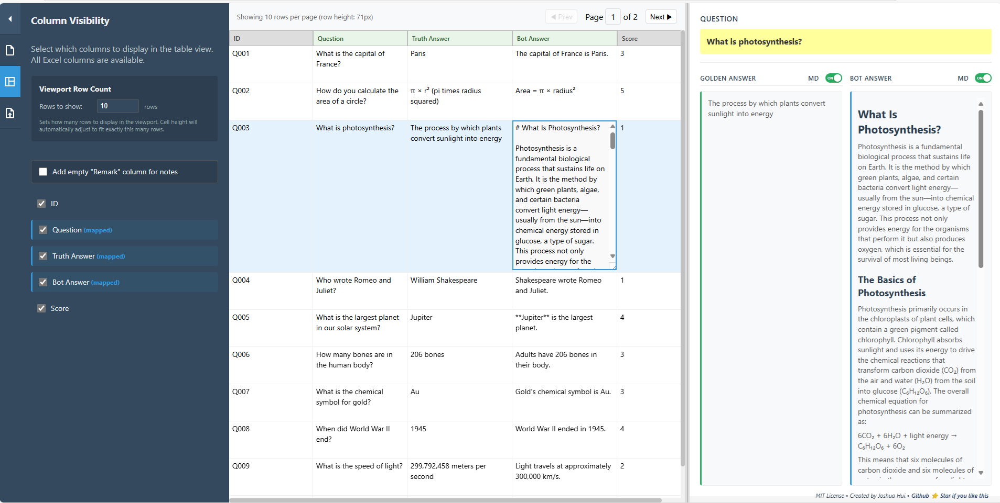

# 🚀 LLMAnswerSplitViewer



<h1 align="center">
  <a href="https://c2js.github.io/LLMAnswerSplitViewer" target="_blank">
     <strong> 👉 Launch App Here 👈</strong>
  </a>
</h1>

<p align="center">
  https://c2js.github.io/LLMAnswerSplitViewer/
</p>

---

## 😤 Tired of Excel Frustrations? We've Got You Covered!

**Stop wrestling with EXCEL columns!** 🤼‍♀️ No more endless resizing, font size hunting, or wrap/unwrap toggling just to read your LLM evaluation data. 

### 🎯 What is LLMAnswerSplitViewer?

A **lightning-fast**, **zero-installation** web tool that transforms your LLM evaluation experience from painful 😫 to delightful 😍! This powerful **side-by-side / dual viewer** lets you **compare**, **visualize**, and analyze your data in a **parallel view** that makes evaluating questions, golden answers, and bot responses a breeze.

## ✨ Why You'll Love It

### 🆚 Excel vs LLMAnswerSplitViewer

| Excel Struggles 😩 | Our Solution 🎉 |
|-------------------|-----------------|
| 📏 Constant column resizing | ✅ **Smart auto-sizing** - columns adjust perfectly |
| 🔍 Hunting for font size options | ✅ **Instant readability** - optimized typography |
| 🔄 Wrap/unwrap text nightmare | ✅ **Intelligent text wrapping** - always readable |
| � Plain text only - no formatting | ✅ **Markdown support** - beautiful formatted content |
| 🗂️ Messy column rearrangement | ✅ **Drag & drop columns** - reorder with ease |
| 📤 Export everything or nothing | ✅ **Selective export** - choose only what you need |
| �💾 Heavy installation required | ✅ **Zero installation** - works in any browser |
| 🐌 Slow loading with large files | ✅ **Lightning fast** - optimized for performance |
| 😵 Overwhelming interface | ✅ **Clean & intuitive** - focus on what matters |

### 🌟 Key Features

- **🎯 Drag & Drop Magic**: Just drop your Excel file and you're ready to go!
- **🔍 Split-View Paradise**: Question, Golden Answer, and Bot Answer side-by-side
- **📝 Markdown Support**: Beautiful markdown rendering for formatted text content
- **⚡ Instant Editing**: Click any cell to edit, It enlarge the editing cell.
- **💡 Hightlight changes**: Cell that modified will highlight background to ease to spot changes.
- **📱 Responsive Design**: Works perfectly on any screen size
- **🎨 Beautiful UI**: No more ugly spreadsheet views
- **💾 Smart Export**: Export your edited data back to Excel with one click
- **🎯 Selective Export**: Export only the columns you need - no more cluttered spreadsheets
- **🔄 Easy Column Rearrangement**: Drag and drop columns to your preferred order
- **⌨️ Keyboard Navigation**: Arrow keys to navigate like a pro
- **🎛️ Column Control**: Show/hide columns as needed
- **📊 Smart Pagination**: Handle large datasets without lag

## 🚀 Getting Started (It's That Easy!)

### 🌐 Option 1: Use this link
[https://c2js.github.io/LLMAnswerSplitViewer/](https://c2js.github.io/LLMAnswerSplitViewer/)
This site runs entirely in your browser — no data is sent to any server.


### 🌐 Option 2: Download & Run Locally (Recommended)
1. 🌐 Visit [LLMAnswerSplitViewer](https://github.com/c2js/LLMAnswerSplitViewer) 
2. Look for the **"app"** folder 📁
3. Download all files from the app folder and put them in the same folder on your computer 💾 (index.html & main.<"randonnumber">.js)
4. Open the `index.html` file to start using the tool 🎉
5. Drag your Excel file 📎
6. Start to compare! 🎉

### 💻 Option 3: Developer Favour

```bash
# Clone the repository
git clone <repository-url>
cd LLMAnswerSplitViewer

# Install dependencies (one-time setup)
npm install

# Start the magic ✨
npm start
```

Open `http://localhost:3000` and you're ready to rock! 🎸

## 🎮 How to Use

### 📥 Import Your Data
1. **Drag & Drop** your `.xlsx` or `.xls` file onto the upload area
2. **Map your columns** - tell us which columns contain:
   - 🤔 **Questions** 
   - 🎯 **Golden Answers**
   - 🤖 **Bot Answers**
3. Hit **Show Data** and watch the magic happen! ✨

### 🔍 Navigate Like a Pro
- **Click any row** to see detailed view in the side panel.
- **Use arrow keys** ⬆️⬇️ to navigate between rows
- **Click any cell** to edit in-place and enter enlarge mode for editing
- **Press Escape** to exit enlarge mode and return to normal view
- **Resize panels** by dragging the divider
- **+/- Row count** in Toolpane, increase or decrease the row count to find the best fit of rows at your screen resolution.

### 📤 Export Your Work
- Click the **Export** button 📤
- Choose your filename (optional)
- Pick the columns to export (optional)
- Download your improved Excel file! 💾

## 🎯 Perfect For

- **🤖 AI Researchers** evaluating model responses
- **📊 Data Scientists** analyzing LLM outputs  
- **🎓 Students** working on NLP projects
- **👨‍💼 Product Managers** reviewing chatbot performance
- **Anyone** tired of Excel's height, width resizing !

## 🛠️ Technical Features

- **⚡ Client-side processing** - your data never leaves your computer
- **🔒 Privacy-first** - no server uploads required
- **📱 Responsive design** - works on desktop, tablet, and mobile
- **🎨 Modern React interface** - smooth and intuitive
- **💾 Excel compatibility** - supports .xlsx and .xls formats

## 🔒 Privacy & Security

**Your data stays with YOU!** 
- ✅ **100% Client-side processing** - No data leaves your browser
- ✅ **No server uploads** - Everything happens locally
- ✅ **No tracking** - We don't collect any user data
- ✅ **No cookies** - Clean browsing experience
- ✅ **Open source** - Full transparency, audit the code yourself

## 🤝 Contribute & Make It Better!

We believe in the power of community! 🌟 This tool is designed to make LLM evaluation easier for everyone, and we'd love your help in making it even better! Whether you're a seasoned developer or just getting started, there are many ways to contribute:

- 🐛 **Report bugs** - Help us squash those pesky issues
- 💡 **Suggest features** - Share your ideas for improvements
- 🔧 **Submit pull requests** - Add new functionality or fix issues
- 📚 **Improve documentation** - Help others understand the tool better
- 🎨 **Enhance UI/UX** - Make the interface even more beautiful and intuitive
- ⚡ **Optimize performance** - Help us make it faster and more efficient

Together, we can build the ultimate LLM evaluation tool! 🚀

## 🏗️ Built With Love Using

- ⚛️ **React 18** - For lightning-fast UI
- 📊 **SheetJS** - For Excel file processing
- 🎨 **Modern CSS** - For beautiful styling
- 🚀 **Webpack** - For optimized bundling


Creates an optimized build ready for deployment! 🌐

## 📝 License

MIT License - Use it, modify it, love it! ❤️
